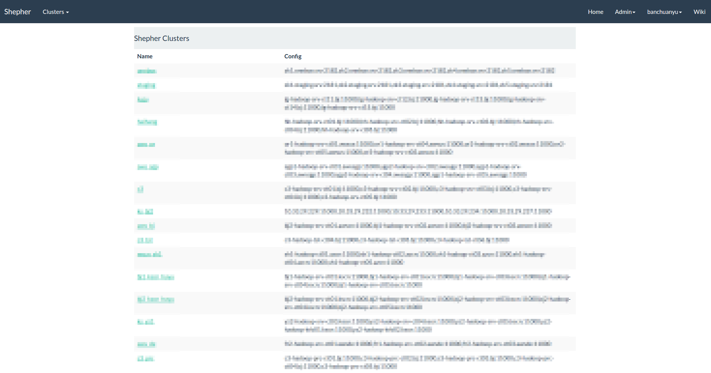
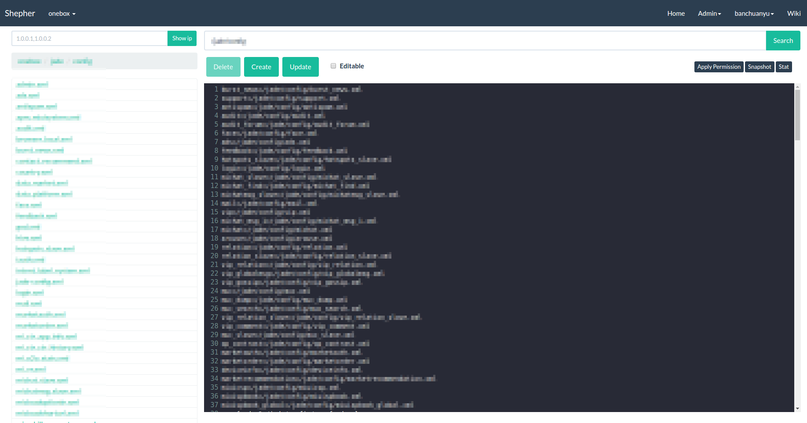

Shepher is a management tool of ZooKeeper. In Xiaomi, we use it as the configuration management center. [Readme 中文版](README-zh.md)

## Character
- Visualized operation of ZooKeeper node
- Snapshot management of ZooKeeper node
- Modified Diff and Review function of ZooKeeper node
- Mail operation notification of ZooKeeper node
- Integrates CAS and LDAP log
- Authority management, reference to [Authority management instruction](Docs/Authority.md)

## Function comparison of similar products
Product | Introduction | Visualized operation of nodes | Snapshot management | Node modified Diff and Review function | Node operated mail notification | CAS and LDAP log | Authority management | Cascade delete | System status monitor
---|---|---|---|---|---|---|---|---|---
Shepher | ZooKeeper management | √ | √ | √ | √ | √ | √ |   |  
TaoKeeper | ZooKeeper cluster monitor and statement |   |   |   |   |   |   |   | √
Zkdash | ZooKeeper management | √ | √ |   |   |   |   | √ |  
Disconf | ZooKeeper management | √ | √ |   | √ |   | √ | √ | √
XDiamond | Configuration center | √ |   |   |   | √ | √ |   | √

## Screenshots
- Home


- Node view


## Installation

### Environment requirements
- JDK 1.8
- Maven 3.2 +
- MySQL 5.6

### Basic configuration

- Modify `INSERT INTO user VALUES (1,'youradmin',now());` in `db/init.sql`, change `youradmin` into your administrator user name
- According to [Parameter instruction](Docs/Parameter.md), modify parameter configuration under the directory `shepher-web/src/main/resources`. If you are using a CAS login, you need to modify the CAS-related configuration and set the `server.login.type` to `CAS`; If you log in with LDAP, you will need to modify the LDAP-related configuration and set `server.login.type` to `LDAP`

### Development environment deployment

Development environment deployment includes local compilation deployment and Docker deployment, you can choose a deployment based on usage.

#### Compile
1. Modify parameter configuration of `conf/application*.properties` according to [Parameter instruction](Docs/Parameter.md)
2. Local compile

    ```sh
    $ mvn clean package 
    $ cd shepher-packaging/target/shepher-packaging-{version}-bin
    $ ls
    bin/(all the shell scripts)
    conf/(configuration files)
    db/init.sql
    lib(required jar files)
    Dockerfile
    docker-compose.yml
    CHANGES.txt
    NOTICE.txt
    README.md
    README-zh.md
    VERSION
    ```
    Here, {version} refers to the current Shepher version.

#### Local deployment

1. Import `db/init.sql` in to MySQL
2. Enter install directories

    ```sh
    $ cd shepher-packaging/target/shepher-packaging-{version}-bin
    ```
3. Run the script, start Shepher service

    ```sh
    $ sh bin/run.sh start 
    ```
4. Visit `http://localhost:8089` or self defined `server.url` (Reference to [Parameter instruction](Docs/Parameter.md))

#### Docker deployment

MySQL and ZooKeeper will be automatic integrated when Docker deployment is used, and automatically import `db/init.sql` into MySQL, no self installation is needed.

1. Install Docker, take Ubuntu system for example, install [docker engine](https://docs.docker.com/engine/installation/#installation) and [docker-compose](https://docs.docker.com/compose/install/)
2. Enter install directories

    ```sh
    $ cd shepher-packaging/target/shepher-packaging-{version}-bin
    ```
3. Run the script, start Shepher service and waiting start of each container in Docker accomplish

    ```sh
    $ sh bin/docker-run.sh start 
    ```
4. Visit `http://localhost:8089` or self defined `server.url` (Reference to [Parameter instruction](Docs/Parameter.md))

### Production environment deployment

The steps for production environment deployment is similar to local compiling deployment, but pay attention to the setting of data sources, CAS/LDAP and domain names. In addition, because each company's internal mail service is relatively closed, you need to implement your own `CustomMailSender` class, and set `mail.sender=customMailSender` in` conf/application.properties`, so that Shepher can use the mail service normally.

1. Import `db/init.sql` into MySQL
2. Create the file `conf/application-online.properties`, and modify the configuration according to [Parameter instruction](Docs/Parameter.md)
3. Run the command in the Shepher root directory

    ```sh
    $ mvn clean package
    ```
4. Copy `shepher-packaging/target/shepher-packaging-{version}-bin` to the production environment, and enter the directory 

    ```sh
    $ cd shepher-packaging/target/shepher-packaging-{version}-bin
    ```
5. Run the command below, start Shepher

    ```sh
    $ sh bin/run.sh -c conf/application.properties,conf/application-online.properties start 
    ```
6. Visit self defined `server.url` (Reference to [Parameter instruction](Docs/Parameter.md))

## Contributors

**Long Xie** ([@xielong](https://github.com/xielong)),
**Jinliang Ou** ([@oujinliang](https://github.com/oujinliang)),
**Chuanyu Ban** ([@banchuanyu](https://github.com/banchuanyu)),
**Chuyang Wei** ([@brianway](https://github.com/brianway)),
**Peng Zhang** ([@monsters-peng](https://github.com/monsters-peng)),
**Yaoli Liu** ([@iloayuil](https://github.com/iloayuil))
